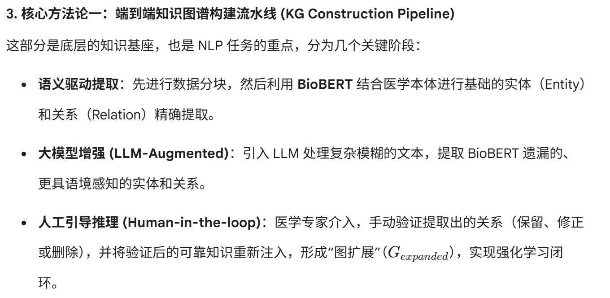

# md-image-embed

[](LICENSE)
[](https://docs.anthropic.com/en/docs/claude-code)
[](#)
[](#)
[](#)

> 将 Markdown 文件中的本地图片引用转为 base64 内嵌，让一个 MD 文件就能独立显示所有图片。

## 痛点

你有一个带图片的 Markdown 文件：

```markdown


```

把这个 `.md` 发给别人——**图片全裂了**。因为图片在*你的*电脑上，别人没有。

## 解决方案

`md-image-embed` 把所有本地图片路径转成 base64 内嵌：

```markdown


```

**一个文件，图片全在里面，发给谁都看得见。**

## 效果演示

### 转换前——发给别人图片全裂

```
论文阅读/
├── 笔记.md              ← 发这个给别人？
├── images/
│   ├── figure1.png      ← 别人没有这些图
│   └── figure2.png
```

### 转换后——一个文件搞定

```
笔记.md                  ← 直接发这一个，图片全在里面
```

### 实际使用示例图片

以下图片直接内嵌在 demo markdown 文件中：

| 图片 | 说明 |
|------|------|
|  | 研究框架概览 |
|  | 模型架构图 |
|  | 实验结果 |
|  | 整体流程图 |

## 功能特性

- **自动检测** — 扫描所有 `` 格式的图片引用
- **智能跳过** — 已经是 base64 的和远程 URL（http/https）不会重复处理
- **URL 解码** — 自动处理路径中的 `%20` 等编码字符
- **相对路径支持** — 基于 MD 文件所在目录解析相对路径
- **格式广泛** — 支持 PNG、JPG、GIF、SVG、WebP、BMP、TIFF

## 使用方式

### 作为 Claude Code Skill 使用

这是一个 [Claude Code](https://docs.anthropic.com/en/docs/claude-code) 技能。安装后直接说：

```
把这个 md 的图片内嵌进去，我只发一个文件
```

或者使用斜杠命令：

```
/md-image-embed
```

### 手动安装

将 `SKILL.md` 复制到 Claude Code 的 skills 目录：

```bash
# 项目级安装
mkdir -p .claude/skills/md-image-embed
cp SKILL.md .claude/skills/md-image-embed/

# 或用户级安装
mkdir -p ~/.claude/skills/md-image-embed
cp SKILL.md ~/.claude/skills/md-image-embed/
```

### 独立使用（Python 脚本）

核心逻辑是 Python 脚本，可以直接运行：

```python
import base64, re, os
from urllib.parse import unquote

def embed_images(md_path):
    md_dir = os.path.dirname(os.path.abspath(md_path))
    with open(md_path, 'r', encoding='utf-8') as f:
        content = f.read()

    def replace(match):
        alt, path = match.group(1), unquote(match.group(2).strip())
        if path.startswith('data:') or path.startswith(('http://', 'https://')):
            return match.group(0)
        abs_path = os.path.join(md_dir, path) if not os.path.isabs(path) else path
        if not os.path.isfile(abs_path):
            return match.group(0)
        with open(abs_path, 'rb') as f:
            b64 = base64.b64encode(f.read()).decode()
        ext = os.path.splitext(abs_path)[1].lower()
        mime = {'.png':'image/png','.jpg':'image/jpeg','.jpeg':'image/jpeg',
                '.gif':'image/gif','.svg':'image/svg+xml','.webp':'image/webp'}.get(ext,'image/png')
        return f''

    result = re.sub(r'!\[([^\]]*)\]\(([^)]+)\)', replace, content)
    with open(md_path, 'w', encoding='utf-8') as f:
        f.write(result)

# 使用
embed_images('你的笔记.md')
```

## 适用场景

| 场景 | 是否适用 |
|------|---------|
| 把 MD 文件单独发给别人 | 适用 |
| MD 中有本地/绝对路径图片 | 适用 |
| 图片已经是远程 URL | 不适用（自动跳过） |
| 图片已经 base64 内嵌 | 不适用（自动跳过） |
| 超大图片（>5MB） | 建议先压缩 |

## 文件大小说明

Base64 编码会让数据量增大约 33%。1MB 的图片在 MD 中约 1.3MB。如果图片很多很大，建议：

- 先压缩/缩放图片再内嵌
- 使用图片压缩工具
- 权衡：文件稍大 vs. 图片永远不会裂

## 许可证

[MIT](LICENSE)
